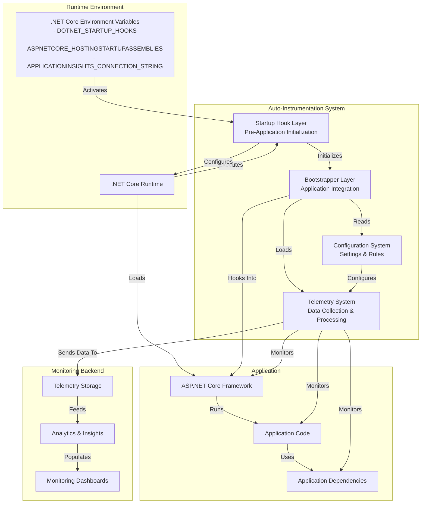
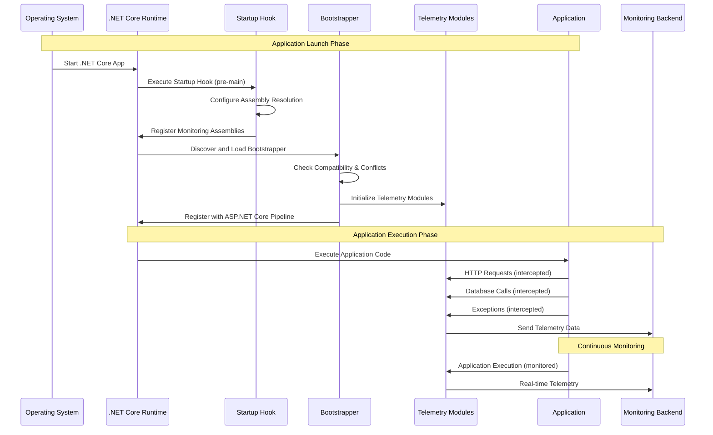

# Application Insights Auto-Instrumentation Architecture
## Technical Architecture for Patent Application

### Abstract

This document describes a novel system architecture for automatic instrumentation of software applications without requiring code modifications. The system provides a method for injecting monitoring capabilities into running .NET Core applications through a non-invasive process that leverages runtime hooks and dynamic assembly loading techniques. The architecture addresses several key challenges in application monitoring, including compatibility across different versions of the .NET Core framework, isolation from application code, and configuration without application modification.

### Background

Traditional application monitoring solutions require developers to explicitly add instrumentation code to their applications, resulting in increased development effort, potential for errors, and complications in the deployment process. This invention provides a technical solution to these challenges by enabling automatic instrumentation through a novel runtime attachment mechanism that requires no code changes and minimal configuration.

### Technical Problem Addressed

The invention addresses several technical problems in the field of application monitoring:

1. **Non-invasive Monitoring**: Enabling comprehensive application monitoring without modifying application source code or requiring recompilation
2. **Cross-framework Compatibility**: Supporting diverse .NET Core framework versions with a unified monitoring infrastructure
3. **Runtime Attachment**: Establishing monitoring capabilities at runtime before application code executes
4. **Assembly Isolation**: Preventing conflicts between monitoring components and application dependencies
5. **Dynamic Configuration**: Supporting monitoring configuration without application changes

### Architecture Overview

The system employs a multi-layered architecture with specialized components that interact with the .NET Core runtime environment to establish monitoring capabilities before application code executes. The architecture is optimized for the .NET Core runtime environment.

#### Key Architectural Components

The auto-instrumentation architecture consists of several layers that work together to enable monitoring without application code changes:

1. **Startup Hook Layer**
   - Acts as the entry point into the application process
   - Executes before any application code runs
   - Establishes the foundation for the instrumentation system
   - Configures the runtime to redirect assembly loading as needed

2. **Bootstrapper Layer**
   - Performs compatibility detection with the application
   - Handles intelligent "back-off" when manual instrumentation is detected
   - Manages the lifecycle of telemetry components
   - Bridges the startup hook and the telemetry system

3. **Telemetry System**
   - Collects performance data and exceptions across the application
   - Monitors HTTP requests, database calls, and external dependencies
   - Tracks application metrics and custom events
   - Ensures proper correlation between related telemetry items

4. **Configuration System**
   - Processes environment variables and configuration files
   - Applies default settings and overrides for different environments
   - Supports dynamic mapping rules to customize monitoring behavior
   - Enables zero-code configuration for diverse deployment scenarios

The key innovation in this architecture is how these components collaborate with the .NET Core runtime and application without requiring code changes:

This architecture enables comprehensive application monitoring with these key characteristics:

- **Zero-Code Integration**: Application code remains completely unchanged
- **Early Attachment**: Monitoring begins before the first line of application code executes
- **Complete Coverage**: Captures all aspects of application behavior including startup
- **Isolation**: Monitoring components don't interfere with application dependencies
- **Adaptability**: Automatically adjusts to different .NET Core versions and environments

### Technical Implementation Details

#### Runtime Attachment Mechanism

The system employs the .NET Core Runtime Startup Hook mechanism for runtime attachment:

- Utilizes the .NET Runtime Startup Hook mechanism
- Entry point is established before application code execution
- Environment variable `DOTNET_STARTUP_HOOKS` points to the runtime hook assembly
- Special ASP.NET Core integration via `ASPNETCORE_HOSTINGSTARTUPASSEMBLIES` for web applications

#### Dynamic Assembly Loading and Resolution

A key technical aspect of the invention is its assembly loading and resolution strategy:

1. **Custom Assembly Resolution**:
   - Intercepts assembly resolution requests from the runtime
   - Routes specific assembly requests to monitoring components
   - Maintains isolation from application assemblies

2. **Version Compatibility Detection**:
   - Analyzes the runtime environment to determine compatible monitoring components
   - Selects appropriate implementation based on detected versions
   - Adapts monitoring behavior to the runtime environment

3. **Assembly Isolation Strategy**:
   - Prevents monitoring assemblies from interfering with application assemblies
   - Uses specialized packaging to avoid dependency conflicts
   - Maintains separate loading paths for monitoring components

#### Multi-Phase Initialization Process

The system employs a multi-phase initialization process to ensure proper monitoring establishment:

1. **Pre-Application Phase**:
   - Executed before application code runs
   - Establishes basic monitoring infrastructure
   - Registers necessary runtime hooks

2. **Framework Initialization Phase**:
   - Integrates with ASP.NET Core framework initialization
   - Registers monitoring components with framework services
   - Establishes framework-specific monitoring points

3. **Post-Initialization Phase**:
   - Completes monitoring configuration after framework initialization
   - Finalizes telemetry pipeline setup
   - Validates monitoring establishment

#### Telemetry Collection Architecture

The system establishes multiple telemetry collection points throughout the application:

1. **HTTP Request Monitoring**:
   - Captures incoming HTTP requests
   - Tracks request duration, status codes, and performance metrics
   - Maintains distributed trace context across services

2. **Dependency Monitoring**:
   - Tracks outbound calls to external services
   - Monitors database operations and external APIs
   - Correlates dependency calls with originating requests

3. **Exception Monitoring**:
   - Captures unhandled exceptions throughout the application
   - Records exception details, stack traces, and context
   - Associates exceptions with related telemetry

4. **Custom Metric Collection**:
   - Establishes channels for application performance metrics
   - Monitors CPU, memory, and resource utilization
   - Tracks application-specific performance indicators

#### Configuration Without Application Changes

The system provides multiple mechanisms for configuration without requiring application changes:

1. **Environment Variable Configuration**:
   - Uses predefined environment variables to control monitoring behavior
   - Supports connection strings, authentication settings, and feature flags
   - Enables deployment-time configuration changes

2. **Dynamic Mapping Configuration**:
   - Supports mapping different monitoring destinations based on application characteristics
   - Uses pattern matching to apply configuration rules
   - Enables multi-tenant monitoring configurations

3. **External Configuration Files**:
   - Supports JSON-based configuration files for advanced settings
   - Monitors configuration changes for dynamic updates
   - Provides hierarchical configuration inheritance

### Novel Technical Aspects

This invention presents several novel technical aspects:

1. **Pre-Application Execution Attachment**:
   - The system establishes monitoring before application code executes, ensuring comprehensive coverage of application behavior.
   - Unlike traditional profiling tools that attach after startup, this approach captures the full application lifecycle.

2. **.NET Core Version Adaptability**:
   - The architecture adapts to different .NET Core versions while providing consistent monitoring capabilities.
   - The system dynamically adjusts its behavior based on detected framework characteristics.

3. **Zero-Code-Change Monitoring**:
   - The invention enables sophisticated monitoring without requiring any application code changes.
   - This approach significantly reduces the barrier to adoption and maintenance costs.

4. **Dynamic Assembly Resolution Strategy**:
   - The system employs a specialized assembly resolution strategy that prevents conflicts between monitoring components and application code.
   - This approach solves a significant technical challenge in runtime monitoring systems.

5. **Adaptive Configuration System**:
   - The configuration system adapts to application characteristics and deployment environments.
   - Configuration inheritance and mapping rules provide sophisticated monitoring control without application changes.

### Implementation Variations

The architecture supports several implementation variations:

1. **Cloud Service Integration**:
   - Integration with cloud platform services for automatic configuration
   - Support for managed identity authentication
   - Cloud-specific deployment models

2. **On-Premises Deployment**:
   - Support for on-premises monitoring destinations
   - Integration with enterprise monitoring systems
   - Offline configuration capabilities

3. **Hybrid Monitoring Scenarios**:
   - Support for multi-destination telemetry routing
   - Cross-platform correlation of monitoring data
   - Combined cloud and on-premises monitoring

4. **Container and Kubernetes Integration**:
   - Specialized attachment mechanisms for containerized applications
   - Pod lifecycle integration for Kubernetes deployments
   - Sidecar and init container deployment models

### Alternative Embodiments

The architecture could be extended in several alternative embodiments:

1. **Additional .NET Runtime Support**:
   - Extension to other .NET runtime variants
   - Specialized deployment patterns for different environments
   - Optimization for specific runtime scenarios

2. **Embedded Systems Integration**:
   - Adaptation for resource-constrained environments
   - Specialized telemetry collection for embedded devices
   - Integration with IoT monitoring platforms

3. **Serverless Function Monitoring**:
   - Specialized attachment for serverless function runtimes
   - Cold-start capture and performance analysis
   - Function-specific telemetry collection

### Conclusion

The auto-instrumentation architecture represents a novel approach to .NET Core application monitoring that addresses fundamental technical challenges in the field. By establishing monitoring capabilities before application execution, maintaining isolation from application code, and supporting configuration without application changes, the system provides significant advantages over traditional monitoring approaches. The architecture's flexible design supports diverse implementation scenarios while maintaining consistent monitoring capabilities across different .NET Core application environments.
